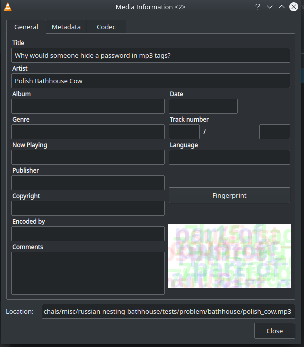
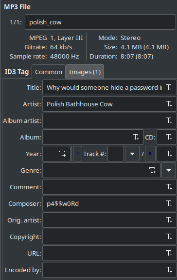

# Solving

```
file russian-nesting-bathhouse.zip
	russian-nesting-bathhouse.zip: gzip compressed data, from Unix, original size modulo 2^32 4014080
tar -xzvf russian-nesting-bathhouse.zip
cd problem
ls
	bathhouse_password  bathhouse.zip
file bathhouse_password
	bathhouse_password: data
unzip bathhouse.zip
	Archive:  bathhouse.zip
	[bathhouse.zip] bathhouse/polish_cow.mp3 password:
	<we don't know the password yet>
xxd -l 4 bathhouse_password 
	00000000: d6df 472f
```

PDF Magic Bytes: `25 50 44 46` (https://en.wikipedia.org/wiki/List_of_file_signatures)

```
original file : 25 50 44 46
          key : xx xx xx xx
   xored file : d6 df 47 2f
```

key = repeating (`25 50 44 46 ^ d6 df 47 2f`) = `f38f0369`, which can be solved [here](http://xor.pw/#). 

Decode bathhouse_password with key:

```python
with open("bathhouse_password", "rb") as f:
    contents = f.read()

key = b"\xf3\x8f\x03\x69"
out = b""
for i in range(len(contents)):
    out += bytes([contents[i] ^ key[i % len(key)]])

with open("out.pdf", "wb") as f:
    f.write(out)
# (thanks zander)
```

Viewing the resulting PDF shows password is `this_is_the_first_password_so_creative_right`.

```
unzip -P this_is_the_first_password_so_creative_right bathhouse.zip 
	Archive:  bathhouse.zip
	  inflating: bathhouse/polish_cow.mp3  
cd bathhouse
ls
	polish_cow.mp3
file polish_cow.mp3 
	polish_cow.mp3: Audio file with ID3 version 2.3.0, contains:MPEG ADTS, layer III, v1, 64 kbps, 48 kHz, Stereo
```

Opening `polish_cow.mp3` in any music program should show that it has image, and tags:

**VLC**:


**`strings`**:
```
strings polish_cow.mp3 | less
	6TIT2
	Why would someone hide a password in mp3 tags?TPE1
	Polish Bathhouse CowTCOM
	p4$$w0RdAPIC
	image/png
	IHDR
	iCCPICC profile
	...
```

**EasyTag**:


Now we have a password = `p4$$w0Rd`

```
dd if=polish_cow.mp3 |foremost
	Processing: stdin
	|7960+0 records in
	7960+0 records out
	4075520 bytes (4.1 MB, 3.9 MiB) copied, 0.0552171 s, 73.8 MB/s
	*|
cd output/jpg/
file 00000000.jpg
	00000000.jpg: JPEG image data, JFIF standard 1.01, resolution (DPI), density 300x300, segment length 16, baseline, precision 8, 1337x696, components 3
steghide extract -p 'p4$$w0Rd' -sf 00000000.jpg -xf out
file out
	out: gzip compressed data, from Unix, original size modulo 2^32 10240
tar -xzvf out
	flag_part_2/flag_part_2.txt
cd flag_part_2
cat flag_part_2.txt 
	_dont_forget_5736h1d3}
```

Now for the first part

```
wget http://www.caesum.com/handbook/Stegsolve.jar -O stegsolve.jar
chmod +x stegsolve.jar
java -jar stegsolve.jar
```

Open image, browse through color layers. Find three layers:
- `osu{first_` (red)
- `part_of_` (blue)
- `7h15_flag` (green)

`osu{first_part_of_7h15_flag_dont_forget_5736h1d3}`


